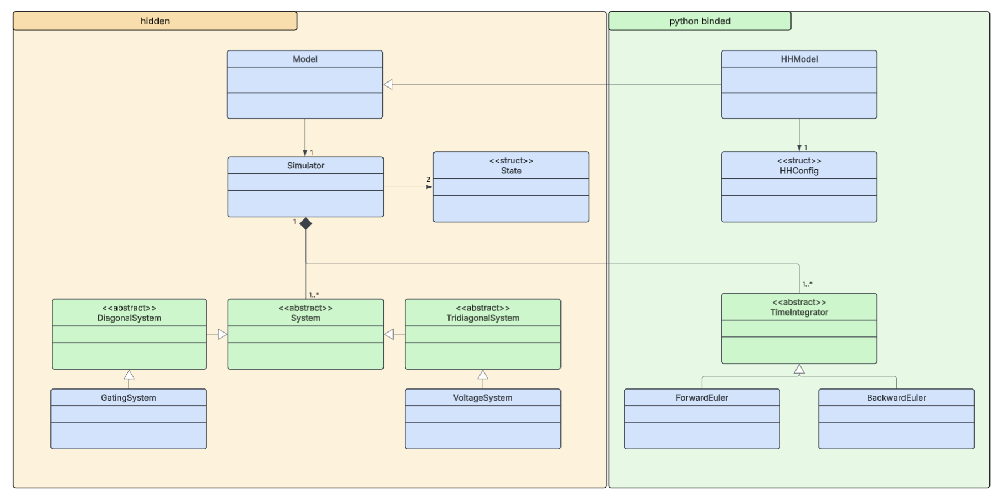

# Hodgkin-Huxley

[](https://hodgkin-huxley-39d204.pages.gitlab.kuleuven.be)

This repository contains a C++ implementation of the Hodgkin-Huxley model for a single-branch multicompartment neuron. The code is structured in a modular way, allowing for easy extension and modification of the model. The main components of the code include:

- `HHModel`: The main class that represents the Hodgkin-Huxley model. It contains methods for configuring the model, running simulations, and extracting results.
- `HHConfig`: A configuration class that allows users to modify the biological parameters of the model, such as conductances and external currents.
- `Integrators`: A set of classes that implement different numerical integration schemes for solving the differential equations of the model. Currently, Forward Euler, Implicit Euler, and Exponential Euler methods are implemented.

The diagram below provides a brief overview of the structure of the code and how the different components interact with each other. Additionally, it shows visually which classes are accessible from Python (green) and which are only available in C++ (orange).  



## Requirements

A few package dependencies are required to build and run the code:

- C++ 17 compatible compiler
- CMake (version 3.15 or higher)
- pybind11 (for Python bindings)
- Boost (for unit testing)

You can install these on Ubuntu/Debian-based systems using the following commands:

```bash
sudo apt update
sudo apt install build-essential cmake libboost-test-dev pybind11-dev python3-dev
```

## Usage in C++

To build and run the code, you can use CMake. Here are the steps:

1. Clone the repository:
   ```bash
   git clone git@gitlab.kuleuven.be:math-eng/h0t46a/2026/team_02/hodgkin-huxley.git
   cd hodgkin-huxley
   ```
2. Create a build directory and navigate into it:
   ```bash
   mkdir build
   cd build
   ```
3. Run CMake to configure the project:
   ```bash
   cmake ..
   ```
4. Build the project:
   ```bash
   cmake --build .
   ```
5. Run the tests:
   ```bash
   ctest
   ```

While a `main.cpp` file is included to run a basic, console-based simulation of the Hodgkin-Huxley model, it serves strictly as a demonstration. The primary focus of this repository is the core C++ implementation and its Python integration. Consequently, `main.cpp` is considered **deprecated** and is no longer maintained. We highly recommend using the Python interface, which provides a much richer and more user-friendly experience.

## Usage in Python

> [!Note] Python version
> The package has only been tested with python 3.12. Please make sure to use python 3.12 when installing the package, otherwise you might run into issues.

The C++ code can be integrated into Python using pybind11. The file `python/bindings.cpp` contains the necessary code to create Python bindings for the Hodgkin-Huxley model. After cloning the project, you can install it into the Python environment using pip:

```bash
pip install .
```

However, cloning is not necessary since we have also set up a `pyproject.toml` file, which allows you to directly install the package from the git repository using pip:

```bash
pip install "git+ssh://git@gitlab.kuleuven.be/math-eng/h0t46a/2026/team_02/hodgkin-huxley.git"
```

The current python environment will now have access to a package `HHcpp`, which exposes the C++ implementation of the Hodgkin-Huxley model.
The following example demonstrates how to configure the model, choose an integration scheme, run the simulation, and extract the results for analysis.

```python
import HHcpp # our package installed via pip
import numpy as np

# -- Setup a HHConfig (Optional) ---
# Use this to modify biological parameters like conductances or currents
# If no config is provided, default values will be used!
config = HHcpp.HHConfig()
config.g_Na = 120.0  # mS/cm^2 (default is 120.0)
config.i_ext = 0.5   # nA

# -- Choose an Integration Scheme --
# Available options: ForwardEuler, ImplicitEuler (default), ExponentialEuler
# Note: ExponentialEuler is only available for the gating variables, not for the voltage!
integrator = HHcpp.ImplicitEuler()

# -- Configure and Run the Model ---
# N: number of compartments, L: length in um
model = HHcpp.HHModel(N=10, L=100.0, config=config)
model.run(t_end=120.0, dt=0.1)

# Optional: multiple runs can also be chained together, which will continue the simulation from the last state
# model.run(t_end=200.0, dt=0.1) # starts a new simulation from t=0.0 to t=200.0, resetting the state variables to their initial values
# model.run(t_end=300.0, dt=0.1, reset_before_run=False) # this will continue the simulation from t=200.0 to t=500.0

# --- Extract Data for Analysis ---
ts  = np.array(model.times())    # Time points
Vs  = np.array(model.voltages()) # Membrane potentials (mV)
ms = np.array(model.ms())        # Sodium activation gating
hs = np.array(model.hs())        # Sodium inactivation gating
ns = np.array(model.ns())        # Potassium activation gating
```

## Getting help

If you are struggling with syntax or have questions about the implementation, feel free to use the `help` function in Python to get more information about the available classes and methods. For example:

```python
help(HHcpp.HHModel)  # Get help on the HHModel class
help(HHcpp.HHConfig) # Get help on the HHConfig class
```

Additionally, you can also refer to our tutorial notebooks, which provide step-by-step guides on how to use the package for various simulations and analyses. These notebooks can be found inside the folder HH-benchmarking in our [`benchmarking`](https://gitlab.kuleuven.be/math-eng/h0t46a/2026/team_02/benchmarking) repository.
